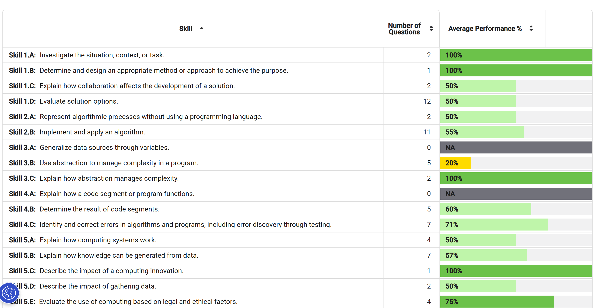

Topics: 

Most missed topics: 

-Nested Conditionals

-Calling Procedures

-Iteration

-Explain how computing systems work

-Fault Tolerance

## Corrections of Missed Questions: 

2) 

Correct Answer: D

Why: A citizen science approach allows many volunteers to analyze images at the same time, which makes the process much faster than if only the small research team did all the work themselves.

What I learnt: Citizen science is useful for projects with large amounts of data because distributing the work across many people increases efficiency and reduces the time needed to complete the task.

6) 

Correct Answer: C

Why: Program I correctly moves the robot to the gray square by repeatedly moving the robot forward, rotating left, moving forward twice, and rotating right.

What I learnt: Program I correctly moves the robot to the gray square by repeatedly moving the robot forward, rotating left, moving forward twice, and rotating right. Program II correctly moves the robot to the gray square by moving the robot forward to the bottom right corner of the grid, rotating left, moving the robot forward to the upper right corner of the grid, rotating left, and moving forward to the gray square.

7) 

Correct Answer: C

Why: Flight simulation software provides a more realistic experience for pilots than actual training flights.

What I learnt: While some simulations are realistic, they are simplified representations of more complex objects or phenomena.

10) 

Correct Answer: B

Why: This code segment initially sets cost to 6 (the cheapest possible ticket price), then increases cost by 2 for people whose age is greater than 12. Regardless of the person’s age, cost is increased by 2 for people going on a guided tour.

What I learnt: I learned how to use separate conditional statements to adjust a base value step by step. By starting with the lowest possible cost and adding to it based on age and whether a tour is included, the algorithm correctly accounts for all combinations of conditions.

12) 

Correct Answer: C

Why: The decimal value 75 is equal to 64 + 8 + 2 + 1, which is equal to, which is equal to the binary number 01001011. The decimal value 0 is equal to the binary number 00000000. The decimal value 130 is equal to 128 + 2, which is equal to, which is equal to the binary number 10000010.

What I leanrt: I learned how to convert decimal numbers to 8-bit binary form for RGB color representation. Each color component—red, green, and blue—is expressed as an 8-bit binary number to create the correct color in a computing application.

18) 

Correct Answer: B

Why: This code segment moves the robot forward whenever there is an open square in front of it. Once there is not an open square in front of it, the robot rotates right. The robot moves forward from its initial location to the upper right corner of the grid, then rotates right, then moves forward to the bottom right corner of the grid, then rotates right, then moves forward to the bottom left corner of the grid, then rotates right, then moves forward two squares to the gray square.

What I learnt: I learned how nested loops and movement conditions can control a robot’s path. By repeatedly moving forward until blocked and then rotating right, the robot follows the perimeter of the open spaces and eventually reaches the goal. This shows how checking conditions before moving helps guide correct navigation.

22) 

Correct Answer: D

Why: For this spinner, there was a chance of "Lose a turn", a chance of "Move 2 spaces", and a chance of "Move 1 space". The variable spin is set to a random value between 1 and 8. If spin is 1 (which occurs of the time), the code segment prints "Lose a turn". If spin is 2 (which occurs 
of the time), the code segment prints "Move 2 spaces". The remaining of the time, the code segment prints "Move 1 space".

What I learnt: I learned how to use a random number range to simulate probabilities. By assigning numbers to each outcome according to the spinner’s size, the code correctly models the likelihood of each result, with “Move 1 space” being more likely because it covers more numbers.

23) 

Correct Answer: D

Why: The flowchart sets available to true whenever weekday is true and miles is less than 20, and sets available to false otherwise. This code statement provides the same functionality

What I learnt: I learned how to translate a flowchart into a single Boolean expression. The variable available is true only when both conditions—weekday is true and miles is less than 20—are met, which shows how AND logic combines multiple requirements in code.

25) 

Correct Answer: C

Why: Statement I is false. The Internet is not controlled from a central device. Statements II and III are true. The Internet uses redundant routing to support fault tolerance. The Internet uses protocols so that data is transmitted in a standard format.

What I learnt: I learned that the Internet works through decentralized, fault-tolerant routing and standardized protocols. Data can be rerouted if a connection fails, and protocols ensure different computers can communicate, without needing a central computer to control everything.

30) 

Correct Answer: D

Why: The string "out of range" could only be displayed if the condition n ≥ 1 was false. If the initial value of n is at least 0, then n will be incremented by 1, making n at least 1. Therefore the condition n ≥ 1 will be true and "out of range" will not be displayed. If the initial value of n is negative, then n will be multiplied by -1, making n at least 1. Therefore the condition n ≥ 1 will be true and "out of range" will not be displayed.

What I learnt: I learned how to trace a program’s logic step by step to determine all possible outputs. By analyzing how n is changed and the conditions that follow, I can see that “out of range” can never occur because n is always at least 1 after the initial adjustment.

37) 

Correct Answer: A

Why: The code segment draws four line segments, each with a left endpoint at the coordinate (2, 6). The first line segment has a right endpoint at the coordinate (8, 8). The loop repeatedly subtracts two from endY, so that the subsequent line segments have their right endpoints at (8, 6), (8, 4), and (8, 2).

What I learnt: I learned how to use a loop with a variable that changes each iteration to draw multiple line segments. By updating endY after drawing each line, the code creates all four lines from the common starting point to the correct endpoints.

43) 

Correct Answer: C

Why:  It is possible to have redundant routing in both configurations. In configuration I, some possible routes between computers Q and V include Q-P-V, Q-T-V, and Q-R-S-V. In configuration II, some possible routes between computers Q and V include Q-S-V, Q-R-T-V, and Q-P-T-V.

What I learnt: I learned that redundant routing occurs when there are multiple paths between two devices. Both network configurations allow Q and V to communicate through several different routes, which increases reliability in case one connection fails.

48) 

Correct Answer: C

Why: A user receives an e-mail from a sender offering technical help with the user’s computer. The e-mail prompts the user to start a help session by clicking a provided link and entering the username and password associated with the user’s computer. 

What I learnt: Phishing is a technique that is used to trick a user into providing personal information. In this case, the user is tricked into providing a username and password to an unauthorized individual posing as a technical support specialist.

52) 

Correct Answer: A

Why: The REPEAT UNTIL loop terminates when hours is at least 24 or currentPop is at most 0. Statements II and III are false. The simulation displays the change in population over the entire course of the simulation.

What I learnt: I learned how a REPEAT UNTIL loop can control a simulation based on multiple conditions. The program calculates the total change in population over the simulation, stopping either after 24 hours or if the population reaches zero, rather than showing averages or the final population.

56) 

Correct Answer: D

Why: Version I calls the GetPrediction procedure once for each element of idList, or four times total. Since each call requires 1 minute of execution time, version I requires approximately 4 minutes to execute. Version II calls the GetPrediction procedure twice for each element of idList, and then again in the final display statement. This results in the procedure being called nine times, requiring approximately 9 minutes of execution time.

What I learnt: I learned that repeatedly calling a time-consuming procedure can greatly affect a program’s execution time. Version II calls GetPrediction multiple times per player, making it much slower than Version I, even though both versions produce the same result.

59) 

Correct Answer: C

Why: 
The original developer of open-source software provides free or low-cost support for users installing and running the software is not true. 

What I leanrt: Open-source software has source code that is released under a license that allows users the rights to use and distribute it. However, there is no guarantee that the original developer of open-source software will provide support for its users.

66) 

Correct Answer: Choice 1 and 3

Why: This line should be removed. The variable count should increase by 1 when currentNum is a perfect number, so it should only be incremented in the body of the IF statement.  This line should be removed. Every integer from start to end should be checked, so currentNum should only be incremented inside the loop but outside the body of the IF statement.

What I learnt: I learned that careful placement of increment statements is important in loops. Incrementing currentNum inside the IF statement causes some numbers to be skipped, so removing that line ensures every number from start to end is checked correctly.

## Future Action: 

I will go back and review these topics to strengthen my understanding of both specific skills and broader computer science concepts. Specifically, I will:

Broader Topic Areas:

-Algorithms and Program Logic – tracing loops, conditionals, and variable updates; understanding flowcharts and translating them to code.

-Data Structures and Loops – using lists, loops, and counters effectively in simulations and calculations.

-Boolean Logic and Decision Making – applying AND, OR, and conditional statements correctly.

-Probability and Randomness – using random numbers in simulations and games, and understanding probability-based outcomes.

-Networks and Communication – redundant routing, fault tolerance, and protocols in network configurations.

-Number Systems and Data Representation – converting decimal numbers to binary, especially for RGB color codes.

